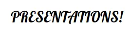

    

### presentation folder 

- Computer Science에 대해 깊게 공부하고 각자 발표하는 스터디 발표 자료 

- 2022.02.02 

    - slideshare 대신 issuu 사이트를 선택

- [https://issuu.com/39ghwjd](https://issuu.com/39ghwjd)

| 자료 | 날짜 | 파일 |
|---|---|---|
| 브라우저 동작 원리 | 2022.1.12 | [브라우저 동작 원리](./Browser_Principle.pdf)|
| DP Algorithm | 2022.1.19 | [DP 알고리즘](./DP_Algorithm.pdf)|
| OS 내부 구조 | 2022.1.26 | [OS 내부 구조](./OS_Inner_Structure.pdf)|
| DB | 2022.2.9 | [DB](./DB.pdf)|
| CPU Schedule | 2022.2.16 | [CPU Schedule](./CPU_Schedule.pdf)|
| REST를 알아보자 | 2022.2.23 | [REST](./Do_You_Know_Rest.pdf)|
| Web Page 뒤에는 무슨 일이 일어나고 있는가 | 2022.3.1 | [Web Page 뒤에서는 무슨 일이 일어나는가](./Web_Page_Back.pdf)|
| HTTP | 2022.3.9 | [HTTP](./HTTP.pdf)|
| HTTP ver 2 | 2022.3.16 | [HTTP/2](./HTTP_ver_2.pdf)|
|   |   |

